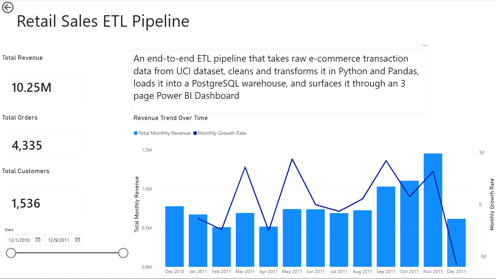
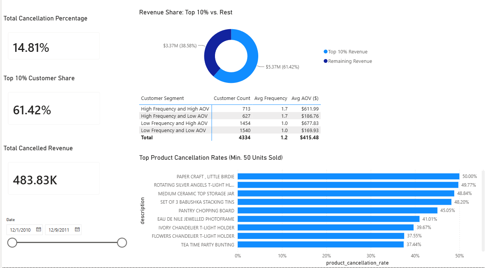
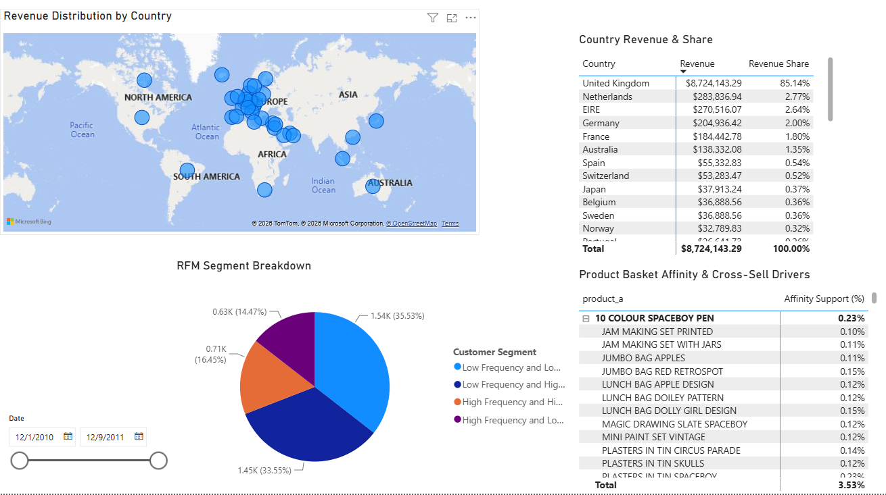

# Retail Sales ETL Pipeline

An end-to-end ETL pipeline that takes raw e-commerce transaction data, cleans and transforms it in Python/pandas, loads it into a PostgreSQL warehouse, and surfaces it through a 3-page executive Power BI dashboard.

## Overview

This project processes ~500K transaction records from a UK-based online retailer (2010–2011) — sales, cancellations, adjustments, and non-sale transactions — into a dimensional PostgreSQL model with 46 analytical views across 8 business categories.

Along the way I ran into (and fixed) a few real bugs: a sign error in cancellation quantities, a product-affinity query that exploded to 1.5M rows before I filtered it down, and an ETL sequencing issue that was quietly inflating a duplicate-detection metric by almost 20x. Those are documented below, since finding and fixing that stuff is most of what the job actually is.

## Architecture

```text
UCI ML Repo — Online Retail Dataset (id=352)
                │
                ▼
Extract
`src/extract/dataset.py`
                │
                ├── Fetch dataset via ucimlrepo
                └── Save as data/raw/data.csv + data_ids.csv
                │
                ▼
Transform
`src/transform/transaction.py`
                │
                ├── Classify transaction types
                │   ├── Sale
                │   ├── Cancellation
                │   ├── Account Adjustment
                │   ├── Inventory Adjustment
                │   └── Zero-Value / Non-Sale
                │
                ├── Remove exact duplicate rows
                ├── Flag potential duplicates
                ├── Calculate revenue
                └── Split records by transaction type
                │
                ▼
PostgreSQL Star Schema
`src/load/load_data.py`
                │
                ├── dim_product
                ├── dim_customer
                ├── dim_country
                ├── dim_date
                │
                ├── fact_sales
                ├── fact_cancellations
                ├── fact_adjustment
                ├── fact_non_sale
                │
                └── data_quality_potential_duplicates
                │
                ▼
Analytical Layer
`postgresql/analytics/`
                │
                ├── sales
                ├── product
                ├── customer
                ├── geographic
                ├── cancellation
                ├── adjustment
                ├── non_sales
                └── data_quality
                │
                ▼
46 Analytical Views
                │
                ▼
Power BI
                │
                ├── Executive Overview
                ├── Customers & Risk
                └── Products & Geography


## Data Model

The pipeline loads into a PostgreSQL star schema in the `public` schema — 4 dimension tables and 4 fact tables, plus a standalone data quality audit table. The 46 analytical views (organized into 8 business-category schemas) are all built on top of these 9 tables.

### Dimension Tables

**`dim_date`**
Standard date dimension, one row per calendar day present in the dataset. Carries `year`, `month`, `month_name`, `week`, `day`, `day_of_week`, and `day_name` alongside the `date_key` — precomputing these avoids repeating date-part extraction logic across dozens of analytical views.

```sql
CREATE TABLE IF NOT EXISTS dim_date (
    date_key INTEGER PRIMARY KEY,
    full_date DATE,
    year INTEGER,
    month INTEGER,
    month_name TEXT,
    week INTEGER,
    day INTEGER,
    day_of_week INTEGER,
    day_name TEXT
);
```

**`dim_product`**
Deliberately minimal — just `stock_code` and `description`. The source dataset doesn't include product category, price tier, or other product attributes, so there was nothing else to model here without fabricating data that wasn't in the source.

```sql
CREATE TABLE IF NOT EXISTS dim_product (
    stock_code TEXT PRIMARY KEY,
    description TEXT
);
```

**`dim_customer`**
Just `customer_id`. Like `dim_product`, this stays minimal because the source dataset has no customer demographic or account-level attributes — this table exists mainly to enforce referential integrity and give customer-level views a clean join target.

```sql
CREATE TABLE IF NOT EXISTS dim_customer (
    customer_id INTEGER PRIMARY KEY
);
```

**`dim_country`**
Maps `country_key` to country name. Small lookup table, but it's used across nearly every geographic view.

```sql
CREATE TABLE IF NOT EXISTS dim_country (
    country_key INTEGER GENERATED ALWAYS AS IDENTITY PRIMARY KEY,
    country TEXT UNIQUE
);
```

### Fact Tables

**`fact_sales`**
The core sales table — every legitimate sale transaction, with revenue precomputed (`quantity` × `unit_price`) at load time rather than recalculated in every view. `row_hash` is an MD5 hash of the transaction's identifying fields, used as a conflict key on load so re-running the pipeline doesn't create duplicate rows.

```sql
CREATE TABLE IF NOT EXISTS fact_sales (
    sale_id BIGINT GENERATED ALWAYS AS IDENTITY PRIMARY KEY,
    row_hash VARCHAR(32) UNIQUE,
    invoice_no TEXT,
    stock_code TEXT, 
    quantity INTEGER,
    invoice_date TIMESTAMP,
    unit_price NUMERIC(10,2),
    customer_id INTEGER,
    country_key INTEGER,
    revenue NUMERIC(12,2),
    date_key INTEGER,

    CONSTRAINT fk_sales_product FOREIGN KEY (stock_code) REFERENCES dim_product (stock_code),
    CONSTRAINT fk_sales_customer FOREIGN KEY (customer_id) REFERENCES dim_customer (customer_id),
    CONSTRAINT fk_sales_country FOREIGN KEY (country_key) REFERENCES dim_country (country_key),
    CONSTRAINT fk_sales_date FOREIGN KEY (date_key) REFERENCES dim_date (date_key)
);
```

**`fact_cancellations`**
Same structure as `fact_sales`, holding order cancellations separately rather than as negative-quantity rows mixed into `fact_sales`. Keeping cancellations in their own table made it possible to calculate cancellation rates cleanly (cancelled orders vs. total orders) without cancellations skewing core sales revenue figures.

```sql
CREATE TABLE IF NOT EXISTS fact_cancellations (
    cancel_id BIGINT GENERATED ALWAYS AS IDENTITY PRIMARY KEY,
    row_hash VARCHAR(32) UNIQUE,
    invoice_no TEXT,
    stock_code TEXT, 
    quantity INTEGER,
    invoice_date TIMESTAMP,
    unit_price NUMERIC(10,2),
    customer_id INTEGER,
    country_key INTEGER,
    revenue NUMERIC(12,2),
    date_key INTEGER,

    CONSTRAINT fk_cancellations_product FOREIGN KEY (stock_code) REFERENCES dim_product (stock_code),
    CONSTRAINT fk_cancellations_customer FOREIGN KEY (customer_id) REFERENCES dim_customer (customer_id),
    CONSTRAINT fk_cancellations_country FOREIGN KEY (country_key) REFERENCES dim_country (country_key),
    CONSTRAINT fk_cancellations_date FOREIGN KEY (date_key) REFERENCES dim_date (date_key)
);
```

**`fact_adjustment`**
Holds account and inventory adjustments — rows identified during transform as adjustments rather than genuine customer transactions (e.g. negative unit prices, or zero-price inventory corrections with no customer attached).

```sql
CREATE TABLE IF NOT EXISTS fact_adjustment (
    adjustment_id BIGINT GENERATED ALWAYS AS IDENTITY PRIMARY KEY,
    row_hash VARCHAR(32) UNIQUE,
    invoice_no TEXT,
    stock_code TEXT, 
    quantity INTEGER,
    invoice_date TIMESTAMP,
    unit_price NUMERIC(10,2),
    customer_id INTEGER,
    country_key INTEGER,
    revenue NUMERIC(12,2),
    date_key INTEGER,

    CONSTRAINT fk_adjustment_product FOREIGN KEY (stock_code) REFERENCES dim_product (stock_code),
    CONSTRAINT fk_adjustment_customer FOREIGN KEY (customer_id) REFERENCES dim_customer (customer_id),
    CONSTRAINT fk_adjustment_country FOREIGN KEY (country_key) REFERENCES dim_country (country_key),
    CONSTRAINT fk_adjustment_date FOREIGN KEY (date_key) REFERENCES dim_date (date_key)
);
```

**`fact_non_sale`**
Zero-value transactions and administrative/postage line items (e.g. shipping charges, gift wrap, bank charges) that aren't real product sales but still needed to be tracked. Includes a `transaction_type` column to distinguish the different non-sale categories within this one table.

```sql
CREATE TABLE IF NOT EXISTS fact_non_sale (
    non_sale_id BIGINT GENERATED ALWAYS AS IDENTITY PRIMARY KEY, 
    row_hash VARCHAR(32) UNIQUE,
    invoice_no TEXT,
    stock_code TEXT,
    description TEXT,
    quantity INTEGER,
    invoice_date TIMESTAMP,
    unit_price NUMERIC(10,2),
    customer_id INTEGER,
    country_key INTEGER,
    transaction_type TEXT,
    date_key INTEGER,

    CONSTRAINT fk_non_sale_product FOREIGN KEY (stock_code) REFERENCES dim_product (stock_code),
    CONSTRAINT fk_non_sale_customer FOREIGN KEY (customer_id) REFERENCES dim_customer (customer_id),
    CONSTRAINT fk_non_sale_country FOREIGN KEY (country_key) REFERENCES dim_country (country_key),
    CONSTRAINT fk_non_sale_date FOREIGN KEY (date_key) REFERENCES dim_date (date_key)
);
```

### Standalone Audit Table

**`data_quality_potential_duplicates`**
Holds transaction rows flagged as potential duplicates — rows sharing the same `invoice_no`, `stock_code`, and `quantity` after exact-duplicate rows were already removed. Each row carries `duplicate_group_count`, which reflects how many rows share that same invoice/stock/quantity combination, so a real cluster can be told apart from a lone false positive.

This isn't a dimension or fact table in the traditional sense — it's a standalone data quality audit table, kept separate from `fact_sales` so duplicate detection doesn't interfere with core sales reporting, while still being queryable on its own.

```sql
CREATE TABLE IF NOT EXISTS data_quality_potential_duplicates (
    quality_issue_id BIGINT GENERATED ALWAYS AS IDENTITY PRIMARY KEY,
    invoice_no TEXT,
    stock_code TEXT, 
    quantity INTEGER,
    description TEXT,
    invoice_date TIMESTAMP,
    unit_price NUMERIC(10,2),
    customer_id INTEGER,
    country TEXT,
    transaction_type TEXT,
    issue_type TEXT,
    duplicate_group_count INTEGER
);
```

## Pipeline Files

| File | Description |
| :--- | :--- |
| `src/extract/dataset.py` | Fetches the Online Retail dataset from the UCI ML Repo via `ucimlrepo`, saves it as `data.csv` and `data_ids.csv` under `data/raw/`. |
| `src/transform/transaction.py` | Core transform logic. Classifies every row into Sale / Cancellation / Account Adjustment / Inventory Adjustment / Zero-Value Transaction using a multi-condition rule (price sign, quantity sign, invoice prefix, customer ID). Drops exact duplicate rows, flags potential duplicates, computes revenue, and splits everything into separate CSVs per fact table under `data/processed/`. |
| `src/load/database.py` | Sets up the SQLAlchemy engine connection to PostgreSQL, reading credentials from `.env`. |
| `src/load/load_data.py` | Loads the processed CSVs into PostgreSQL. Builds and loads dimension tables first, creates lookup mappings (country → key, date → key), then loads all fact tables using an upsert pattern (`row_hash` as conflict key) so re-running the pipeline doesn't create duplicate rows. Validates that no fact rows are missing a `country_key` or `date_key` before loading. |
| `postgresql/schema_n_resets/schema.sql` | DDL for all 9 tables, plus the 8 business-category schemas used by the analytical views. |
| `postgresql/schema_n_resets/reset_database.sql` | Drops all tables, used to reset the database to a clean state before a full pipeline re-run. |
| `postgresql/analytics/*.sql` | 8 files, one per business category (sales, product, customer, geographic, cancellation, adjustment, non_sales, data_quality), containing the 46 analytical views that power the Power BI dashboard. |
| `postgresql/analytics/saving_analytics.py` | Standalone backup script — re-runs each analytical view's query independently and exports the result to CSV under `data/analytics/`, so the underlying data behind every dashboard visual has a portable snapshot outside of Power BI/PostgreSQL. |
| `tests/test_environment.py` | Basic environment sanity check (confirms the database connection and required packages are set up correctly). |
| `notebooks/exploration.ipynb` | Exploratory analysis of the raw dataset — checking shape, missing values, data types, and duplicate rows, then prototyping and validating the transaction classification logic (sale/cancellation/adjustment/non-sale) and stock-code cleanup rules cell-by-cell before finalizing them in `transaction.py`. |

## Key Findings

- **Revenue & Growth:** Total revenue across the dataset (Dec 2010 – Dec 2011) came out to $10,246,820.87 — tracked across monthly time-series views and executive KPI scorecards.
- **Product Performance:** "REGENCY CAKESTAND 3 TIER" is the single highest-revenue product, narrowly ahead of "PAPER CRAFT, LITTLE BIRDIE" — though that second product turns out to also have the highest cancellation rate in the entire catalog, a genuinely interesting tension worth digging into further.
- **Customer Concentration:** Revenue is heavily concentrated: the top 10% of customers generate 61.42% of total revenue. Segmenting customers by purchase frequency and average order value shows the largest group (35.53%) falls into "Low Frequency and Low AOV" — meaning over a third of the customer base are low-value, infrequent buyers, while the smallest segment (14.47%) are frequent but low-spending customers.
- **Cancellations:** 14.81% of all orders end in cancellation. At the product level, "PAPER CRAFT, LITTLE BIRDIE" has a 50% cancellation rate — half of every order containing this product gets cancelled, despite it being the second-highest revenue product in the catalog.
- **Geographic Concentration:** 85.14% of total revenue comes from the UK alone, reflecting the dataset's origin as a UK-based retailer with limited but present international order volume.
- **Data Quality:** After identifying and fixing an ETL sequencing bug (see Engineering Challenges & Fixes), the validated duplicate transaction rate is 0.05% — 280 duplicate rows across 98 clusters, mostly simple pairs. Before the fix, a stale flag from an earlier pipeline step had inflated this metric to 0.99%, nearly 20x higher than the true rate.

## Engineering Challenges & Fixes

Each of these was caught through cross-validation — comparing totals against each other, sweeping for negative/null values, checking row counts against known-correct reference views — rather than by noticing something by chance while eyeballing rows.

### 1. Cancellation Quantity Sign Bug

**Symptom:** Cancellation-rate calculations were breaking. For "PAPER CRAFT, LITTLE BIRDIE," `total_sold` and `total_cancelled` came out to the exact same magnitude with opposite signs — 80,995 and -80,995 — which collapsed the rate's denominator to zero and returned `NULL` instead of a real percentage.

**Root cause:** In `transaction.py`, cancellation revenue is correctly derived from the original signed Quantity (negative, per the source dataset's convention), which is necessary — a cancellation should reduce total revenue. But Quantity itself was never separately normalized afterward, so the same negative sign needed for the revenue calculation also flowed into every `SUM(quantity)` aggregate meant to represent "units cancelled" — a count that should never be negative.

**Fix:**
```python
cancellations['revenue'] = cancellations['Quantity'] * cancellations['UnitPrice']
cancellations['Quantity'] = abs(cancellations['Quantity'])
```

Revenue is computed first from the signed value (preserving its correct negative impact on totals), and only afterward is Quantity converted to a positive magnitude. This fix was deliberately not applied to the adjustments table, since adjustment quantities are genuinely bidirectional (real inventory/account corrections go both ways), unlike cancellations, which are conceptually one-directional.

**Verification:**
```sql
SELECT description, total_sold, total_cancelled, unit_cancellation_rate
FROM cancellation.rates_by_product
WHERE description = 'PAPER CRAFT , LITTLE BIRDIE';
-- total_sold: 80,995 | total_cancelled: 80,995 | unit_cancellation_rate: 50.00

SELECT COUNT(*) FROM cancellation.products_by_volume WHERE cancelled_total < 0;
-- 0
```

The previously-broken product now resolves to a valid 50% cancellation rate, and no negative cancellation totals remain anywhere in the view.

### 2. Product Affinity Pairs Explosion

**Symptom:** `product.affinity_pairs` — meant to answer "which products are frequently bought together" — was unusable as a dashboard source due to sheer row count.

**Root cause:**
```sql
SELECT invoice_no, COUNT(DISTINCT stock_code) AS distinct_products
FROM fact_sales
GROUP BY invoice_no
ORDER BY distinct_products DESC
LIMIT 5;
-- 573585 | 1108
-- 581219 | 748
-- 581492 | 730
-- 580729 | 720
-- 558475 | 703
```

A small number of extreme outlier invoices were driving a combinatorial explosion. Invoice 573585 alone had 1,108 distinct products — a self-join on that single invoice generates n × (n-1) / 2 candidate pairs, or roughly 613,000 pairs from one invoice. These weren't normal customer baskets; they were bulk/wholesale-style orders skewing the self-join.

**Fix:** Filter out oversized invoices before the self-join runs, rather than filtering the results after:

```sql
WITH normal_invoices AS (
    SELECT invoice_no FROM fact_sales
    GROUP BY invoice_no
    HAVING COUNT(DISTINCT stock_code) <= 100
)
```

Combined with raising the co-occurrence threshold from `HAVING COUNT(...) >= 5` to `>= 20`, so "frequently bought together" reflects a statistically meaningful pattern rather than a handful of coincidental co-occurrences.

**Verification:**
```sql
SELECT COUNT(*) FROM product.affinity_pairs;
-- 42,326
```

Down from an unusable 1.5M+ rows to a dashboard-ready 42,326.

### 3. Duplicate-Flag ETL Sequencing Bug

**Symptom:** A `duplicate_group_count` distribution built while validating the Power BI dashboard showed something contradictory — thousands of rows flagged as "potential duplicates" had a group size of exactly 1. A cluster of size 1 isn't a cluster.

**Root cause:** In `transaction.py`, `IsPotentialDuplicateLine` was originally computed on the raw pre-dedup dataset, then exact duplicates were dropped afterward. Rows that were exact duplicates of each other also matched the narrower "potential duplicate" test (same invoice + stock code + quantity), so both got flagged. When one of the pair was removed during exact-duplicate cleanup, its surviving twin kept a stale "potential duplicate" flag from before the cleanup — even though its actual duplicate partner was already gone.

**Fix:**
```python
# Before: flag computed on raw data, before exact-dup removal
normalize_raw_transactions["IsExactDuplicate"] = normalize_raw_transactions.duplicated(keep='first')
clean_df = normalize_raw_transactions[normalize_raw_transactions['IsExactDuplicate'] == False].copy()

# After: flag computed on clean_df, AFTER exact-dup removal
clean_df["IsPotentialDuplicateLine"] = clean_df.duplicated(
    subset=['InvoiceNo','StockCode','Quantity'], keep=False
)
```

Reordering the two steps means the flag is now calculated only on data that's already been cleaned, so it reflects the true final group size.

**Verification:** Diagnosed with a window function comparing the stored flag against a freshly recalculated group size, confirming the mismatch before the fix. After re-running the pipeline, total flagged rows dropped from ~5,180 to 280, spread across 98 distinct duplicate clusters — mostly simple pairs — correcting the dataset-wide duplicate rate from a misleading 0.99% to an accurate 0.05%.

### 4. Cancellation Rate by Country — Silent NULL Join Bug

**Symptom:** An earlier version of `cancellation.rates_by_country` used an `INNER JOIN` on the cancellations side, so any country with zero cancellations disappeared from the view entirely — not shown with a 0% rate, just silently absent. Switching to `LEFT JOIN` surfaced a second, subtler bug: the row now appeared, but with `country = NULL`.

**Root cause:**
```sql
LEFT JOIN dim_country AS dc ON uc.country_key = dc.country_key
```
Joining `dim_country` on `uc.country_key` (the cancellations side) breaks for zero-cancellation countries, since a `LEFT JOIN` with no match produces `NULL` for every cancellations-side column — including `country_key` — and `NULL = dc.country_key` can never evaluate true.

**Fix:** Join `dim_country` using the sales-side key instead, which is guaranteed non-null for every country:
```sql
LEFT JOIN dim_country AS dc ON us.country_key = dc.country_key
```

**Verification:**
```sql
SELECT COUNT(*) FROM cancellation.rates_by_country;  -- 38
SELECT COUNT(*) FROM geographic.revenue;              -- 38
```
Row counts now match exactly, confirming every country resolves to a real name with no silent NULLs or missing rows.

## Dashboard Screenshots

Full-resolution images in [`/powerbi`](./powerbi):

**1. Executive Overview** — KPI cards, monthly revenue trend


**2. Customers & Risk** — revenue concentration, RFM segments, cancellation rates by product


**3. Products & Geography** — geographic revenue distribution, product affinity pairs


## Setup & Local Deployment

### Prerequisites
- **Python 3.10+**
- **PostgreSQL 14+**
- **Power BI Desktop** (optional, for viewing or editing `.pbix` reports)

### 1. Environment Configuration
Clone the repository and create a `.env` file in the root directory:

```env
DB_HOST=localhost
DB_PORT=5432
DB_NAME=retail_db
DB_USER=postgres
DB_PASSWORD=your_password
```

### 2. Database Initialization & ETL Pipeline Execution
Run the setup pipeline to initialize schema objects, extract source files, transform raw records, and load the processed dimensional model:

```bash
# Set up virtual environment and install dependencies
python -m venv venv
source venv/bin/activate  # On Windows: venv\Scripts\activate
pip install -r requirements.txt

# Reset database schema and run the end-to-end pipeline
python postgresql/schema_n_resets/reset_database.py
python -m src.extract.dataset
python -m src.transform.transaction
python -m src.load.load_data
```

### 3. Generate Analytical Snapshots (Optional)
To generate standalone CSV backups of all 46 analytical views outside of PostgreSQL:

```bash
python postgresql/analytics/saving_analytics.py
```


### Repository Structure

```text
retail-etl-pipeline/
│
├── data/
│   ├── raw/
│   ├── processed/
│   └── analytics/
│
├── notebooks/
│   └── exploration.ipynb
│
├── postgresql/
│   ├── analytics/
│   │   ├── *.sql
│   │   └── saving_analytics.py
│   │
│   └── schema_n_resets/
│       ├── schema.sql
│       └── reset_database.sql
│
├── src/
│   ├── extract/
│   │   └── dataset.py
│   │
│   ├── transform/
│   │   └── transaction.py
│   │
│   └── load/
│       ├── database.py
│       └── load_data.py
│
├── tests/
│   └── test_environment.py
│
├── .env.example
├── README.md
└── requirements.txt
```

## License

This project is open-source and available under the [MIT License](LICENSE).
