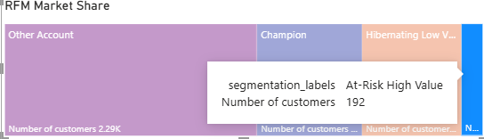
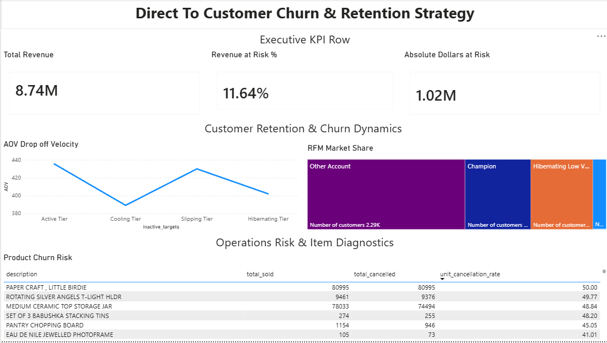

# Customer Churn & Revenue Leakage Analysis

An end-to-end **Data Analytics project** using the UCI Online Retail dataset to investigate customer inactivity, revenue at risk, customer segments, order value, and product cancellation patterns.

I built the project from raw transaction data through **Python/pandas → PostgreSQL → SQL analysis → Power BI**, with the goal of answering a simple question:

> **Where is the business losing value, and what does the transaction data tell us about it?**

---

# The Business Story

The dataset contains approximately **$8.74M in historical revenue**.

At first glance, that is a large revenue base. But looking at total revenue alone does not show where the underlying customer and product problems are.

I broke the analysis into two areas:

1. **Customer behavior** — Are customers becoming inactive, and how much revenue is associated with them?
2. **Product operations** — Are certain products experiencing unusually high cancellation rates?

The Power BI dashboard brings both sides of the analysis together.

---

# 1. The Starting Point: $8.74M in Revenue

The first view of the dashboard establishes the overall size of the business and the amount of revenue associated with inactive customers.


### Executive KPIs

| KPI                      |     Result |
| ------------------------ | ---------: |
| Total Historical Revenue | **$8.74M** |
| Revenue at Risk          | **11.64%** |
| Absolute Revenue at Risk | **$1.02M** |

The **11.64% revenue-at-risk figure** represents historical revenue associated with customers who had been inactive for more than 90 days relative to the latest transaction date in the dataset.

That raised the next question:

> **What does customer behavior look like as customers become less active?**

---

# 2. Customer Retention: Where Does Customer Value Start to Change?


This section of the dashboard looks at customer inactivity from two different angles:

* **Average Order Value (AOV)**
* **RFM customer segmentation**

## AOV Drop-Off

Customers were grouped by the number of days since their most recent purchase.

| Customer Status | Inactivity Period |         AOV |
| --------------- | ----------------: | ----------: |
| Active          |         0–30 days | **$435.40** |
| Cooling         |        31–60 days | **$388.95** |
| Slipping        |        61–90 days | **$429.89** |
| Hibernating     |          91+ days | **$401.88** |

The biggest movement occurs between the **Active** and **Cooling** groups.

AOV falls from **$435.40 to $388.95**, a **10.67% decrease**.

The trend does not continue downward in a straight line, however. AOV rises again in the 61–90 day group before falling to $401.88 among customers inactive for 91+ days.

That was important because it showed that customer inactivity and order value do not have a simple linear relationship.

### What the chart tells us

The biggest AOV drop happens early in the inactivity cycle.

Rather than assuming customers gradually spend less over time, the analysis shows a more complicated pattern:

**Active → sharp AOV drop → temporary increase → lower AOV among long-term inactive customers.**

This gives the business a specific customer behavior pattern to investigate rather than simply labeling every inactive customer the same way.

---

# 3. RFM Segmentation: Who Makes Up the Customer Base?

The same dashboard section also shows the distribution of customers across the RFM segments.

The largest segment is:

**Other Account**

followed by:

**Champion → Hibernating Low Value → At-Risk High Value**

This is useful because the 11.64% revenue-at-risk number does not tell us *who* those customers are.

RFM segmentation adds that customer-level context.

### RFM Metrics

**Recency**

How recently a customer made a purchase.

**Frequency**

How many distinct orders a customer placed.

**Monetary**

How much historical revenue the customer generated.

Each metric was divided into five groups using PostgreSQL `NTILE(5)`.

This produced four reporting segments:

* **Champion**
* **At-Risk High Value**
* **Hibernating Low Value**
* **Other Account**

The goal was not simply to count inactive customers. It was to distinguish between customers who were inactive but historically low value and customers who were inactive while having generated significant revenue.

---

# 4. The Customers We Should Look At First

The RFM analysis identified:

## **192 At-Risk High-Value Customers**



These customers are important because they combine:

* Lower recency scores
* High purchase frequency
* High historical monetary value

In other words, they are not simply customers who stopped purchasing.

They are customers who historically **purchased frequently and generated significant revenue**, but are now showing signs of inactivity.

This turns the broader **$1.02M revenue-at-risk figure** into a more actionable customer-level analysis.

Instead of asking:

> "How many customers are inactive?"

the analysis asks:

> **"Which inactive customers have historically been worth the most?"**

Those 192 customers provide a focused group for further retention or win-back analysis.

---

# 5. The Customer Problem Is Only One Side of the Story

Customer inactivity explains one potential source of revenue risk.

The next question was:

> **Are there problems at the product level that could also be affecting revenue?**

This led to the cancellation analysis.

---

# 6. Product Operations: Where Are Cancellations Concentrated?


The operations section contains a product-level table showing:

* Product description
* Total units sold
* Total units cancelled
* Unit cancellation rate

The table makes it possible to move from a broad cancellation metric to individual products.

The most severe examples were:

| Product                                 | Total Sold | Total Cancelled | Cancellation Rate |
| --------------------------------------- | ---------: | --------------: | ----------------: |
| **PAPER CRAFT, LITTLE BIRDIE**          |     80,995 |          80,995 |       **100.00%** |
| **ROTATING SILVER ANGELS T-LIGHT HLDR** |      9,461 |           9,376 |        **99.10%** |
| **MEDIUM CERAMIC TOP STORAGE JAR**      |     78,033 |          74,494 |        **95.46%** |

### The biggest outlier

`PAPER CRAFT, LITTLE BIRDIE` stands out immediately.

The dataset contains:

* **80,995 total units sold**
* **80,995 total units cancelled**
* **100.00% cancellation rate**

The second-highest example, `ROTATING SILVER ANGELS T-LIGHT HLDR`, has:

* **9,461 total units sold**
* **9,376 cancelled**
* **99.10% cancellation rate**

These are extreme enough to warrant further investigation into the underlying transaction or fulfillment process.

The data does not establish the exact cause, so the analysis treats these as **investigation candidates**, rather than assuming whether the cause was inventory, order processing, supplier issues, or another operational problem.

---

# 7. Finding and Fixing a Data Problem

One of the more useful parts of the project was not a dashboard finding.

It was finding an issue in the calculation itself.

The original cancellation-rate calculation used:

```text
Cancelled Units / (Sold Units + Cancelled Units)
```

For a product with 80,995 units sold and 80,995 units cancelled, this produced:

```text
80,995 / (80,995 + 80,995)
= 50%
```

That did not represent the percentage of ordered units that were cancelled.

I changed the calculation to:

```text
Cancelled Units / Ordered Units
```

The result became:

```text
80,995 / 80,995
= 100%
```

That correction changed the interpretation of the product from a seemingly moderate cancellation rate to a complete cancellation rate.

This was a good reminder that **data validation and metric definitions are just as important as visualization**.

---

# 8. The Full Dashboard



The full dashboard combines the analysis into three sections.

## Executive KPI Row

Answers:

> **How much revenue are we dealing with, and how much is associated with inactive customers?**

Key metrics:

* **$8.74M** total historical revenue
* **11.64%** revenue at risk
* **$1.02M** absolute revenue at risk

---

## Customer Retention & Churn Dynamics

Answers:

> **How does customer value change as customers become inactive, and who are the most important customer segments?**

The section shows:

* AOV across inactivity periods
* The largest AOV drop between Active and Cooling customers
* RFM customer distribution
* Customer segment filtering

The analysis then drills into the **192 At-Risk High-Value customers**.

---

## Operations Risk & Item Diagnostics

Answers:

> **Which products have unusually high cancellation activity?**

The table allows products to be compared by:

* Total units sold
* Total units cancelled
* Cancellation rate

The largest outliers include products with cancellation rates above **95%**, with `PAPER CRAFT, LITTLE BIRDIE` reaching **100%**.

---

# Analytical Methods

## Revenue at Risk

The dataset is historical, so using the current date to calculate customer inactivity would incorrectly classify most customers as inactive.

Instead, I used the maximum transaction date in the dataset (December 9, 2011) as the analysis snapshot date.

For each customer:

```text
Days Inactive =
Dataset Snapshot Date - Customer's Latest Purchase Date
```

Customers with more than 90 days of inactivity were classified as at risk.

---

# RFM Analysis

Customer RFM scores were calculated using:

```text
Recency   = Days since latest purchase
Frequency = Number of distinct orders
Monetary  = Total historical revenue
```

PostgreSQL `NTILE(5)` was used to divide customers into five groups for each metric.

The resulting scores were then used to classify customers into the reporting segments.

---

# AOV Analysis

Average Order Value was calculated as:

```text
AOV =
Total Revenue / COUNT(DISTINCT Invoice Number)
```

Customers were then grouped into four inactivity periods:

```text
0–30 days
31–60 days
61–90 days
91+ days
```

This allowed the analysis to compare order value across different stages of customer inactivity.

---

# Product Cancellation Analysis

Products were evaluated by comparing their total ordered units with total cancelled units.

Products with fewer than 50 ordered units were excluded from the analysis to reduce the effect of very small transaction volumes.

The final metric was:

```text
Cancellation Rate =
Cancelled Units / Ordered Units
```

---

# Data Architecture

The project starts with the UCI Online Retail dataset and moves through Python, PostgreSQL, SQL, and Power BI.

```text
UCI ML Repository
Online Retail Dataset
        |
        v
Python / ucimlrepo API
        |
        v
Raw CSV
        |
        v
Python + pandas
Cleaning & Classification
        |
        v
Processed CSV Files
        |
        v
PostgreSQL
        |
        +-----------------------------+
        |                             |
        v                             v
Dimension Tables                 Fact Tables
        |                             |
        |                             +-- fact_sales
        |                             +-- fact_cancellations
        |                             +-- fact_adjustment
        |                             +-- fact_non_sale
        |
        +-- dim_product
        +-- dim_customer
        +-- dim_country
        +-- dim_date
        |
        v
SQL Analytical Views
        |
        +-- customer
        +-- sales
        +-- cancellation
        +-- product
        |
        v
Power BI
        |
        v
Interactive Dashboard
```

---

# Database Design

The PostgreSQL database separates transactional data from analytical reporting objects.

## Dimension Tables

```text
dim_product
dim_customer
dim_country
dim_date
```

These tables provide descriptive information used throughout the analysis.

## Fact Tables

```text
fact_sales
fact_cancellations
fact_adjustment
fact_non_sale
```

These tables contain the transactional records used to calculate the project's metrics.

---

# Reporting Schemas

The analytical layer is separated into PostgreSQL schemas.

### `sales`

Sales transaction data and sales-related analytical views.

### `customer`

Customer information and RFM segmentation.

### `cancellation`

Cancelled transactions and product cancellation analysis.

### `product`

Product-level analytical views.

### `geographic`

Geographic dimensions used for analysis.

This separation keeps reporting logic organized and makes it easier to build additional analytical views without changing the underlying transaction tables.

---

# SQL Analysis

## Product Cancellation Rate

```sql
CREATE OR REPLACE VIEW cancellation.rates_by_product AS

WITH product_sales AS (

    SELECT
        dp.stock_code,
        dp.description,
        SUM(fs.quantity) AS total_sold

    FROM fact_sales AS fs

    INNER JOIN dim_product AS dp
        ON fs.stock_code = dp.stock_code

    GROUP BY
        dp.stock_code,
        dp.description
),

product_cancellations AS (

    SELECT
        stock_code,
        SUM(quantity) AS total_cancelled

    FROM fact_cancellations

    GROUP BY
        stock_code
)

SELECT
    ps.description,
    ps.total_sold,
    COALESCE(pc.total_cancelled, 0) AS total_cancelled,

    ROUND(
        (
            COALESCE(pc.total_cancelled, 0)::NUMERIC
            / NULLIF(ps.total_sold, 0)
        ) * 100,
        2
    ) AS unit_cancellation_rate

FROM product_sales AS ps

LEFT JOIN product_cancellations AS pc
    ON ps.stock_code = pc.stock_code

WHERE ps.total_sold > 50;
```

---

# RFM Customer Segmentation

```sql
CREATE OR REPLACE VIEW customer.rfm_segment_rankings AS

WITH customer_metrics AS (

    SELECT
        customer_id,
        SUM(revenue) AS grand_total_historical_revenue,
        COUNT(DISTINCT invoice_no) AS customer_orders,

        (
            SELECT MAX(full_date)::date
            FROM dim_date
        ) AS global_snapshot_date,

        MAX(invoice_date)::date AS customer_last_purchase_date

    FROM fact_sales

    GROUP BY
        customer_id
),

ranking AS (

    SELECT
        customer_id,
        grand_total_historical_revenue,
        customer_orders,

        NTILE(5) OVER (
            ORDER BY
                (
                    global_snapshot_date
                    - customer_last_purchase_date
                ) DESC
        ) AS recency,

        NTILE(5) OVER (
            ORDER BY customer_orders ASC
        ) AS frequency,

        NTILE(5) OVER (
            ORDER BY grand_total_historical_revenue ASC
        ) AS monetary

    FROM customer_metrics
)

SELECT
    customer_id,
    recency,
    frequency,
    monetary,

    CASE

        WHEN recency >= 4
             AND frequency >= 4
             AND monetary >= 4
            THEN 'Champion'

        WHEN recency <= 2
             AND frequency >= 4
             AND monetary >= 4
            THEN 'At-Risk High Value'

        WHEN recency <= 2
             AND frequency <= 2
             AND monetary <= 2
            THEN 'Hibernating Low Value'

        ELSE 'Other Account'

    END AS segmentation_labels

FROM ranking;
```

---

# Tech Stack

### Python

* Python
* pandas
* NumPy
* `ucimlrepo`

### SQL / Database

* PostgreSQL
* SQL
* CTEs
* Window Functions
* `NTILE()`
* Aggregations
* Joins
* Views
* Relational Data Modeling

### Visualization

* Power BI
* KPI Cards
* Tables
* Line Charts
* Treemaps
* Interactive Filtering

### Development

* Git
* GitHub
* VS Code

---

# Project Structure

```text
retail-sales-etl-pipeline/
│
├── data/
│   ├── raw/
│   └── processed/
│
├── powerbi/
│   ├── executive KPI Row.png
│   ├── Customer Retention & Churn Dynamics.png
│   ├── At-risk-customer.png
│   ├── Operation Risk & Item Diagnostics.png
│   ├── full_dashboard.png
│   └── retail_pipeline.pbix
│
├── src/
│   ├── extract/
│   ├── transform/
│   └── load/
│
├── postgresql/
│   └── schema_n_resets/
│
├── requirements.txt
└── README.md
```

---

# Running the Project

## 1. Clone the Repository

```bash
git clone https://github.com/Kgo890/retail-sales-etl-pipeline.git

cd retail-sales-etl-pipeline
```

## 2. Create a Virtual Environment

```bash
python -m venv venv
```

### Windows

```bash
venv\Scripts\activate
```

### macOS / Linux

```bash
source venv/bin/activate
```

## 3. Install Dependencies

```bash
pip install -r requirements.txt
```

## 4. Configure PostgreSQL

Create a `.env` file in the project root:

```env
DB_HOST=127.0.0.1
DB_PORT=5432
DB_NAME=retail_sales_db
DB_USER=postgres
DB_PASSWORD=your_secure_password
```

## 5. Run the Pipeline

Initialize the database:

```bash
python postgresql/schema_n_resets/reset_database.py
```

Extract the dataset:

```bash
python -m src.extract.dataset
```

Transform the transaction data:

```bash
python -m src.transform.transaction
```

Load the processed data into PostgreSQL:

```bash
python -m src.load.load_data
```

---

# Power BI File

The Power BI report is included in the repository:

```text
powerbi/retail_pipeline.pbix
```

Open the `.pbix` file in Power BI Desktop to explore the interactive dashboard.

---

# Dataset

This project uses the **Online Retail dataset from the UCI Machine Learning Repository**.

The dataset contains historical retail transactions including:

* Invoice numbers
* Stock codes
* Product descriptions
* Quantities
* Invoice dates
* Unit prices
* Customer IDs
* Countries

The dataset provides the transaction-level data used for the customer, revenue, and product analyses in this project.

---

# Project Takeaways

This project started with a large historical revenue number and broke it down into specific customer and product-level findings.

The analysis found:

* **$8.74M** in historical revenue
* **$1.02M** associated with customers inactive for more than 90 days
* **11.64%** revenue at risk
* A **10.67% AOV drop** between active and cooling customers
* **192 At-Risk High-Value customers**
* A product with **80,995 units sold and 80,995 cancelled**
* A **100.00% cancellation rate** for `PAPER CRAFT, LITTLE BIRDIE`
* A **99.10% cancellation rate** for `ROTATING SILVER ANGELS T-LIGHT HLDR`

The main focus of the project was not just producing these numbers, but tracing them back to the underlying transaction data, validating the calculations, and presenting the results in a way that makes the business questions easier to investigate.

**Raw data → Clean data → SQL analysis → Findings → Power BI dashboard**
